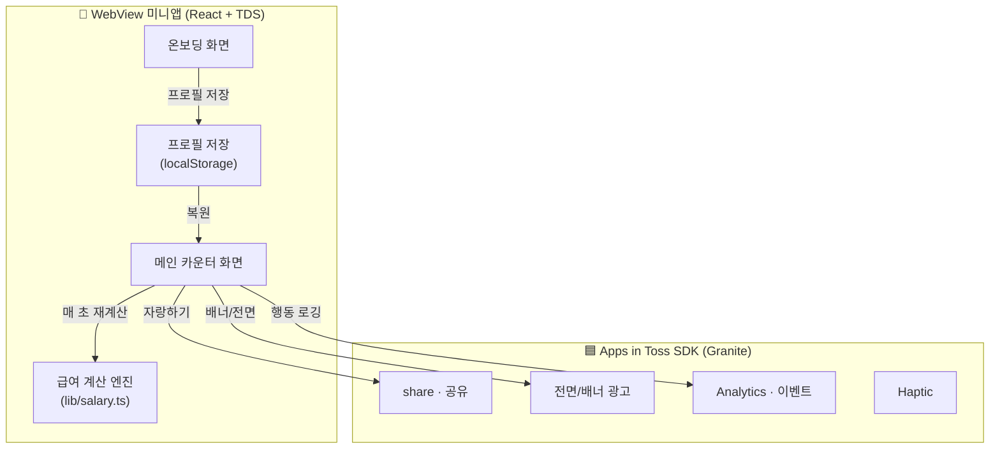

<div align="center">


# 💸 월급 카운터 (Salary Counter)

**출근하는 순간부터 '오늘 번 돈'이 1초 단위로 차오르는 직장인 정신승리 타이머**

[](https://react.dev)
[](https://www.typescriptlang.org)
[](https://vitejs.dev)
[](https://www.tossdesign.com)
[](https://apps-in-toss.toss.im)

토스 앱 속에서 동작하는 **WebView 미니앱**이에요. 연봉과 출퇴근 시각만 넣으면, 접속만 해도 보상감이 차오르는 가벼운 데일리 훅을 지향해요.

</div>

---

## 📑 목차

- [한눈에 보기](#-한눈에-보기)
- [핵심 기능](#-핵심-기능)
- [화면 흐름](#-화면-흐름)
- [기술 스택](#-기술-스택)
- [아키텍처](#-아키텍처)
- [적립액 계산 모델](#-적립액-계산-모델)
- [엔지니어링 하이라이트](#-엔지니어링-하이라이트)
- [로컬 실행](#-로컬-실행)
- [프로젝트 구조](#-프로젝트-구조)
- [면책 고지](#-면책-고지)
- [로드맵](#-로드맵)

---

## 🪙 한눈에 보기

> 연봉을 연간 근무 초로 나눠 **초당 적립액**을 구하고, 출근 시각부터 현재까지 흐른 시간을 곱해
> "오늘 번 돈"을 실시간으로 보여줘요. 점심·오후 슬럼프마다 다시 열어보게 만드는 게 목표예요.

| | |
|---|---|
| **무엇을** | 연봉 기반 실시간 급여 카운터 + 월급일·공휴일 D-day |
| **어디서** | 토스 앱 내 미니앱 (3,000만 토스 유저 노출 가능) |
| **왜** | "접속만 해도 차오르는 보상감"과 "매일 갱신되는 D-day"로 자발 재방문 유도 |
| **누가** | 1인 기획·개발 (기획 · 프론트엔드 · 분석 설계 · 출시) |
| **포지셔닝** | 서버 최소화 클라이언트 앱 — 공유 바이럴 성능을 측정하는 실험체 |

---

## ✨ 핵심 기능

- **실시간 급여 카운터** — 연봉/월급·출퇴근 시각·근무 요일을 입력하면 1초 단위로 '오늘 번 돈'이 차올라요.
- **근무 상태 인식** — 출근 전 / 근무 중 / 퇴근 / 휴무를 자동 판별하고, 퇴근까지 남은 시간을 함께 표시해요.
- **누적 통계** — 이번 주 · 이번 달 · 올해 누적 적립액과 요일별 적립 분포를 보여줘요.
- **D-day 카운트다운** — 다음 월급일과 다음 공휴일까지 남은 날짜로 매일 갱신되는 콘텐츠를 제공해요.
- **밈 공유 카드** — **연봉 숫자는 숨기고** 달성률(%)과 '오늘 번 돈'만 담아 공유해요. (토스 공유 → 실패 시 Web Share API 폴백)
- **게스트 우선** — 로그인 없이 `localStorage`만으로 전 기능을 쓸 수 있어, 진입 마찰을 최소화했어요.
- **광고 수익화** — 메인 배너 광고 + 정보 수정 시 하루 1회 전면 광고.
- **이벤트 분석** — 앱인토스 콘솔 분석 연동. 연봉·금액 같은 민감 값은 원본 대신 **구간(band)으로 묶어** 집계해요.

---

## 📱 화면 흐름

```
[온보딩] 연봉/월급 · 출퇴근 시각 · 근무 요일 · 월급일 입력
   │  (게스트로 바로 시작 · 입력값은 localStorage 저장)
   ▼
[메인 카운터] 오늘 번 돈 실시간 적립 · 달성률 게이지 · 퇴근까지 남은 시간
   ├─ 주/월/연 누적 + 요일별 분포 (DetailStats)
   ├─ 월급일 D-day · 다음 공휴일 D-day
   ├─ '오늘 번 돈 자랑하기' → 공유 카드
   └─ 설정 → 정보 수정 (저장 시 전면 광고 1회)
```

근무 상태(`off` / `before` / `working` / `done`)에 따라 메인 화면의 문구와 카운터 동작이 달라져요. 백그라운드에서 돌아오면 흐른 시간을 다시 계산해 값이 어긋나지 않아요.

---

## 🛠 기술 스택

| 영역 | 사용 기술 |
|---|---|
| **언어** | TypeScript 5.7 (strict) |
| **프론트엔드** | React 18, Vite 6, Emotion |
| **디자인 시스템** | TDS Mobile (`@toss/tds-mobile`, `@toss/tds-mobile-ait`) |
| **플랫폼 SDK** | `@apps-in-toss/web-framework` — Granite 런타임 · 공유 · 광고 · 분석 · 햅틱 |
| **상태/저장** | React 상태 + `localStorage` (서버리스, 게스트 우선) |
| **품질** | ESLint(flat config), Prettier |
| **빌드/배포** | `ait build` → `.ait` 아티팩트 → `ait deploy` (앱인토스 콘솔) |

---

## 🏗 아키텍처



**설계 의도**

- **서버 최소화** — 핵심 로직(적립액·D-day)은 전부 클라이언트 순수 함수라 네트워크 없이 즉시 동작해요. 진짜 2주 MVP가 가능한 구조예요.
- **게스트 우선** — 로그인 없이도 전 기능 사용 가능. 입력값은 검증을 거쳐 `localStorage`에 저장하고, 손상된 데이터는 안전하게 폐기해요.
- **플랫폼 기능은 안전하게 감싸기** — 공유·광고·분석은 토스 앱 밖(웹 브라우저·개발)에서 실패할 수 있어, 모두 try/catch로 감싸 앱 동작에 영향을 주지 않게 했어요.

---

## 🧮 적립액 계산 모델

급여 카운터의 핵심은 `lib/salary.ts`의 순수 함수들이에요.

```
초당 적립액 = 연봉(원) ÷ (근무일수/주 × 52주 × 하루 근무 초)

오늘 번 돈  = 초당 적립액 × (현재 시각 − 출근 시각)   // 근무 중일 때
            = 하루 적립액                              // 퇴근 후
            = 0                                        // 출근 전 · 휴무일
```

- **주/월/연 누적**은 지난 근무일을 하루치로, 오늘은 현재까지로, 예정일은 0으로 더해 계산해요.
- **월급일 D-day**는 말일(`"last"`) 지정과 "이번 달 월급일이 지났으면 다음 달"을 모두 처리하고, 2월처럼 짧은 달엔 말일로 보정해요.
- **공휴일 D-day**는 대체공휴일까지 포함한 목록에서 오늘 이후 가장 가까운 날을 찾아요.
- 모든 날짜 계산은 사용자 기기 로컬 시간 기준이라 시간대 이슈가 없어요.

---

## 💡 엔지니어링 하이라이트

<details open>
<summary><b>1. 백그라운드 복귀에도 어긋나지 않는 실시간 카운터</b></summary>

> 카운터를 누적값으로 굴리지 않고, 매 틱마다 "출근 시각 → 현재 시각"을 다시 계산하는 **순수 함수**로 만들었어요. 그래서 앱이 백그라운드에 갔다 와도, 화면이 멈춰 있었어도 값이 항상 실제 경과 시간과 일치해요. 계산은 전부 `lib/salary.ts`에 모여 테스트하기 쉬운 구조예요.
</details>

<details>
<summary><b>2. 연봉을 숨기는 공유 카드</b></summary>

> '자랑하기'는 바이럴의 핵심이지만 연봉 노출은 부담이에요. 그래서 공유 메시지에는 **달성률(%)과 '오늘 번 돈'만** 담고 연봉 원본은 빼요. 토스 네이티브 `share`를 먼저 시도하고, 실패하면 브라우저 `navigator.share`로 폴백해 환경에 상관없이 동작해요. 공유 시작·완료·취소를 각각 로깅해 퍼널을 측정해요.
</details>

<details>
<summary><b>3. 개인정보를 노출하지 않는 분석 설계</b></summary>

> 연봉·금액처럼 값이 무한정 많은 항목을 원본으로 보내면 집계도 어렵고 개인정보 위험도 있어요. `amountBand` / `earnedBand` / `paydayType`으로 **구간을 묶어** 전송해, 대시보드에서 바로 코호트를 볼 수 있으면서도 원본 연봉은 절대 나가지 않아요. Web SDK가 제공하는 `screen / impression / click` 3종에 맞춰 이벤트를 정리했어요.
</details>

<details>
<summary><b>4. 진입 마찰을 없앤 게스트 우선 저장</b></summary>

> 로그인 강제는 첫 화면 이탈의 가장 큰 원인이에요. 프로필을 `localStorage`에 저장하되, **불러올 때 타입·범위를 검증**해 손상되거나 옛 형식의 데이터는 조용히 버리고 온보딩으로 보내요. `localStorage`가 막힌 환경에서도 세션 동안은 정상 동작하도록 저장 실패를 흡수해요.
</details>

<details>
<summary><b>5. 사용자 행동에 맞춘 전면 광고 타이밍</b></summary>

> 전면 광고는 거슬리기 쉬워, **신규 첫 설정에는 띄우지 않고** 기존 정보를 수정·저장하는 순간에만 하루 1회 노출해요. 정보 수정 화면에 들어오는 즉시 광고를 미리 로드해 두어, 저장 버튼을 누르면 지연 없이 떠요.
</details>

---

## 🚀 로컬 실행

```bash
# 의존성 설치
npm install

# 개발 서버 (Granite dev)
npm run dev

# 빌드 → .ait 아티팩트 생성
npm run build

# 앱인토스 콘솔로 배포
npm run deploy
```

> 배포에는 [앱인토스 콘솔](https://apps-in-toss.toss.im/) > 워크스페이스 > API 키에서 발급한 콘솔 API 키가 필요해요.

---

## 📂 프로젝트 구조

```
src/
├─ App.tsx                  # 온보딩 ↔ 메인 분기, 전면 광고 타이밍
├─ main.tsx                 # TDS Provider 부트스트랩
├─ pages/
│  ├─ OnboardingPage.tsx    # 연봉·출퇴근·근무일·월급일 입력
│  └─ MainPage.tsx          # 실시간 카운터 · 통계 · D-day · 공유
├─ components/
│  ├─ BannerAdSlot.tsx      # 메인 배너 광고
│  ├─ DetailStats.tsx       # 주/월/연 누적 + 요일별 분포
│  └─ DetailStatsUnlock.tsx # 상세 통계 해금 UI
└─ lib/
   ├─ salary.ts             # 적립액·D-day 계산 엔진 (순수 함수)
   ├─ holidays.ts           # 공휴일 목록 + 다음 공휴일 D-day
   ├─ storage.ts            # localStorage 프로필 저장/검증
   ├─ analytics.ts          # 이벤트 로깅 래퍼 (구간 밴딩)
   ├─ interstitialAd.ts     # 전면 광고 프리로드/노출
   └─ types.ts              # Profile 타입 · 기본값
```

---

## ⚠️ 면책 고지

이 앱이 보여주는 금액은 **실제 급여가 아닌 재미용 단순 환산값**이에요. 토스의 급여 관리·이체 기능과 무관하며, 세전/세후 정확한 계산이나 금융 서비스를 제공하지 않아요.

---

## 🗺 로드맵

- [ ] 연차 시뮬레이터 · 보너스/성과급 계산기 (보상형 광고 게이트로 해금)
- [ ] 연말정산 D-day · 보너스 달 시즌 이벤트
- [ ] 타이머 테마 · 캐릭터 꾸미기 (인앱결제)
- [ ] 토스 로그인 연동 · 프로필 클라우드 동기화
- [ ] 비정형 근무(프리랜서·교대) 지원

---

<div align="center">
<sub>1인 기획·개발 · Apps in Toss WebView 미니앱 · 클라이언트 중심 서버리스 설계</sub>
</div>
